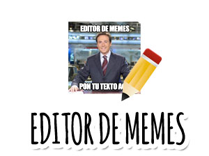

 
 #### ★ Proyecto: Editor de memes
 #### Este proyecto forma parte del segundo módulo del curso Desarrollo Web Front End, dictado por AdaITW. La propuesta consiste en crear una aplicación para generar tus propios memes. En ella podrás cargar una imagen de tu dispositivo o agregar una Url, editarla a gusto y descargarla.

 Website
 
 [Mira aquí mi Editor](generadordememes.netlify.app) 

Funcionalidad

 ⋆ Editor de memes
   - Alternar entre paneles
   - Abrir y cerrar paneles
   - Descargar imagen
   - Modo claro y modo oscuro

 ⋆ Diseño responsivo:
   - Smartphone
   - Tablet

 ⋆ Imagen
   - Cargar imagen desde un dispositivo
   - Agregar imagen con url
   - Cambiar color de fondo
   - Cambiar modo de mezcla de fondo
     ⌑ Aclarar
     ⌑ Oscurecer
     ⌑ Diferencia
     ⌑ Luminosidad
     ⌑ Multiplicar

 ⋆ Cambiar filtros
   - ✔ Construido con:
   - ✔ JAVASCRIPT
   - ✔ HTML5
   - ✔ CSS3
   - ✔ GIT
   - ✔ Deploy en NETLIFY

 ⋆ Recursos:
   - ✔ Fuente: Open Sans - https://fonts.google.com/
   - ✔ Íconos: https://fontawesome.com/
   - ✔ Colores modo claro: e4e3e3, bebdbd, c7c6c6, cacaca, fafafa, black.
   - ✔ Colores modo oscuro: 2e323c, 2a4150, 5b7d86, 424652, 7297a1, white.